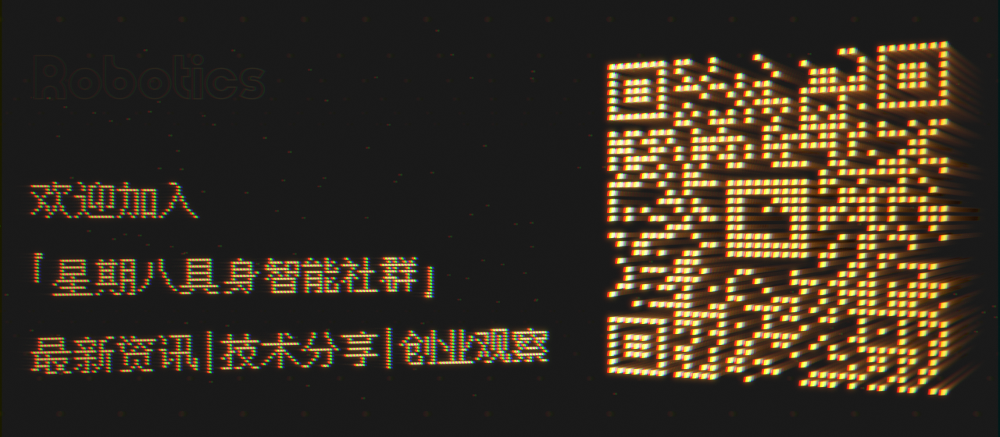

<div align="center">
  <h1>具身智能知识索引与产业地图</h1>
</div>

<div align="center">
  
</div>

<div align="center">
  <p>面向实验室与产业一线的开放知识入口：论文、工具、数据、公司与岗位，按目标直达。</p>
</div>

<p align="center">
  
  
  
  
  
</p>

<p align="center">
  <strong>本周更新（2026-08-14）</strong>：数据集页重构，新增 6 个代表性数据集专题（规模、模态、官方入口与样例图）。
</p>

<p align="center">
  🌐 <a href="topics/README_EN.md">English Version</a>
</p>

## 按需自取

具身智能（Embodied AI）是智能体通过物理身体与环境实时交互，完成感知、决策与执行的系统，交叉计算机视觉、强化学习与多模态大模型。

不确定从哪开始？建议顺序：**认知基座 → 论文 / 竞赛 → 工具 → 数据集 → 公司 / 岗位**。

| 我想… | 去这里 | 当前规模 |
| :--- | :--- | :--- |
| 从零建立认知框架 | [认知基座](topics/00-basics.md)<br>[推荐书籍](topics/00-basics.md#recommended-books)<br>[在线课程](topics/00-basics.md#online-courses) | 14 本书 · 16 门课 |
| 追论文、看开源实现 | [论文合集](topics/03-papers.md) | 362 篇，专题链接如下：<br>• [Embodied Foundation Models](topics/03-papers.md#embodied-foundation-models)<br>• [Manipulation & Teleoperation](topics/03-papers.md#manipulation)<br>• [Locomotion](topics/03-papers.md#locomotion)<br>• [Navigation & Spatial Intelligence](topics/03-papers.md#navigation-spatial-intelligence)<br>• [Simulators & Sim2Real](topics/03-papers.md#simulation-sim2real)<br>• [Datasets](topics/03-papers.md#datasets)<br>• [Benchmarks & Evaluation](topics/03-papers.md#benchmarks-evaluation)<br>• [Survey](topics/03-papers.md#survey) |
| 查竞赛与顶会日历 | [学术与竞赛](topics/05-research-hub.md) | 21 项竞赛 · 10 场会议 |
| 找仿真、SDK、ROS 与开源项目 | [工具与开源项目](topics/04-tools.md) | 156 项 |
| 找训练数据 | [数据集目录](topics/06-datasets.md) | 6 个专题页 |
| 看全球企业图谱 | [公司列表](topics/01-companies.md) | 285 家（国内 180 · 国外 105） |
| 找全职 / 实习 / 校招 | [招聘信息](topics/02-jobs.md) | 538 个岗位（国内 354 · 海外 85 · 专项 99）<br><br>国内：[地平线](topics/02-jobs.md#jump-jobs-domestic-15) · [傅利叶智能](topics/02-jobs.md#jump-jobs-domestic-04) · [高仙机器人](topics/02-jobs.md#jump-jobs-domestic-08) · [节卡机器人](topics/02-jobs.md#jump-jobs-domestic-02) · [极智嘉 Geek+](topics/02-jobs.md#jump-jobs-domestic-01) · [千寻智能](topics/02-jobs.md#jump-jobs-domestic-17) · [上海人工智能实验室](topics/02-jobs.md#jump-jobs-domestic-20) · [商汤科技](topics/02-jobs.md#jump-jobs-domestic-23) · [思谋科技](topics/02-jobs.md#jump-jobs-domestic-19) · [它石智航](topics/02-jobs.md#jump-jobs-domestic-09) · [小鹏汽车](topics/02-jobs.md#jump-jobs-domestic-16) · [星动纪元](topics/02-jobs.md#jump-jobs-domestic-06) · [银河通用机器人](topics/02-jobs.md#jump-jobs-domestic-07) · [云深处科技](topics/02-jobs.md#jump-jobs-domestic-18) · [宇树科技](topics/02-jobs.md#jump-jobs-domestic-03) · [智元机器人](topics/02-jobs.md#jump-jobs-domestic-25) · [逐际动力](topics/02-jobs.md#jump-jobs-domestic-05) · [字节跳动](topics/02-jobs.md#jobs-special-25)<br><br>海外：[AIM Intelligent Machines](topics/02-jobs.md#jump-jobs-overseas-02) · [Amazon Robotics](topics/02-jobs.md#jump-jobs-overseas-06) · [Apptronik](topics/02-jobs.md#jump-jobs-overseas-07) · [Aurora](topics/02-jobs.md#jump-jobs-overseas-08) · [Boston Dynamics](topics/02-jobs.md#jump-jobs-overseas-09) · [Cruise](topics/02-jobs.md#jump-jobs-overseas-10) · [Figure AI](topics/02-jobs.md#jump-jobs-overseas-13) · [Google DeepMind](topics/02-jobs.md#jump-jobs-overseas-14) · [Grit Ventures](topics/02-jobs.md#jump-jobs-overseas-15) · [HTX](topics/02-jobs.md#jump-jobs-overseas-17) · [Nuro](topics/02-jobs.md#jump-jobs-overseas-19) · [NVIDIA](topics/02-jobs.md#jump-jobs-overseas-21) · [OpenAI](topics/02-jobs.md#jump-jobs-overseas-22) · [Tactus](topics/02-jobs.md#jump-jobs-overseas-24) · [Tesla](topics/02-jobs.md#jump-jobs-overseas-26) · [Toyota Research Institute](topics/02-jobs.md#jump-jobs-overseas-27) · [Waymo](topics/02-jobs.md#jump-jobs-overseas-28) · [Wayve](topics/02-jobs.md#jump-jobs-overseas-01) |

## 共建

欢迎补充公司、论文、工具、数据，或修正错误。

- [贡献指南](topics/CONTRIBUTING.md)
- [Pull Request](https://github.com/Octoday-Hub/Embodied-AI/pulls)
- [Issue](https://github.com/Octoday-Hub/Embodied-AI/issues)

如果这份索引对你有帮助，欢迎 Star、Fork 或引用。

## 关于

星期八（Octoday Hub）是由具身智能爱好者、开发者与行业观察者组成的开放社区。名字取自「第七天之外的增量」：在学术之外补产业视角，在算法之外补物理世界约束。

- 邮箱：[octoday@yeah.net](mailto:octoday@yeah.net)
- 微信：Midsummer_Jin
- 公众号：星期八Robotics

扫描下方二维码获取更新：



## 引用

```bibtex
@misc{octoday_robotics_2026,
  author = {Octoday Embodied-AI Community},
  title  = {具身智能知识索引与产业地图},
  year   = {2026},
  url    = {https://github.com/Octoday-Hub/Embodied-AI}
}
```

## 许可证

本项目内容采用 [CC BY-NC-SA 4.0](https://creativecommons.org/licenses/by-nc-sa/4.0/) 许可。

## 领域地图

未来会逐步健全以下板块：

`🧭 认知基座`：帮助初学者从零建立对具身智能的认知框架。

`💻 前沿信号`：持续追踪最新论文，形成可复用的研究地图。

`🛠️ 工具矩阵`：开发框架与工具链，支撑从实验到落地实践。

`📖 课程资源`：整合课程与学习资源，搭建系统化知识路径。

`🧩 职业通道`：梳理技能图谱与面试指南，赋能成长发展。

`🌐 资本动态`：追踪投融资动态，洞察产业结构与资源趋势。

`📡 行业观察`：关注政策、风向、事件与阶段性行业拐点。

`📦 数据地图`：汇聚全球具身智能数据集，打通训练数据资源。
