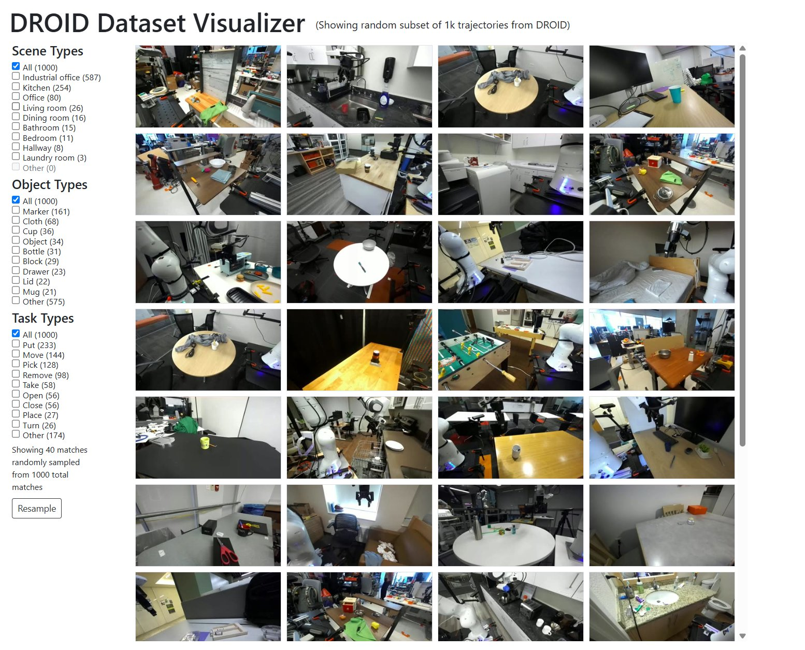
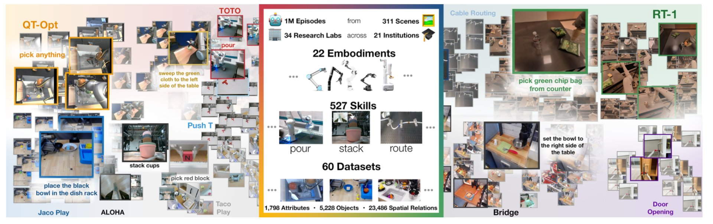
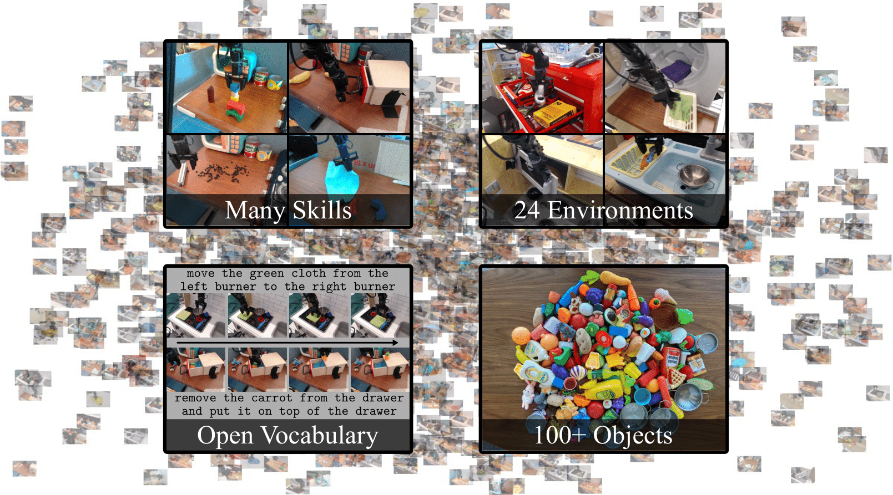
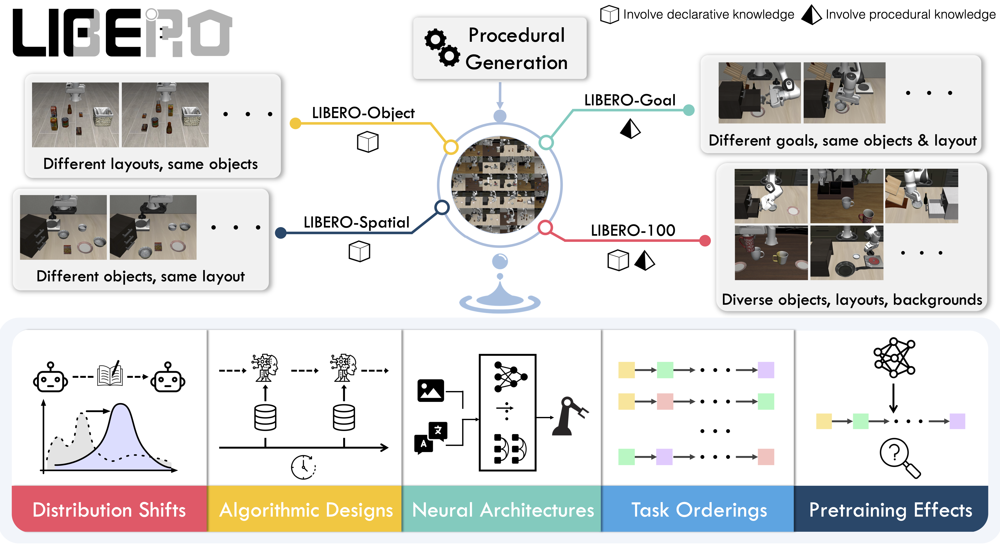

# 具身智能数据集

> 6 个有代表性的具身智能数据集，覆盖真实采集、跨机器人汇总、RGB-D / 力 / 触觉、桌面操作、仿真基准与数据生成。统计以官方主页、仓库与论文为准。

---

### 索引

| 数据集 | 定位 | 类型 | 体量规模 | 关键模态 | 官方主页 |
|---|---|---|---|---|---|
| [DROID](#droid) | 13 家北美实验室的大规模真实世界遥操作数据集 | 真实采集 | ~76k 轨迹 / 564 场景 | RGB + 本体感觉 + 语言 | [官方主页](https://droid-dataset.github.io/) |
| [Open X-Embodiment / RT-X](#open-x-embodiment--rt-x) | 21 家机构汇总的真实机器人数据集集合 | 真实采集 + 汇总 | 1M+ 轨迹 / 22 embodiment | RGB + 语言 | [官方主页](https://robotics-transformer-x.github.io/) |
| [RH20T](#rh20t) | 含力 / 触觉 / 音频多模态的接触丰富操作 | 真实采集 | 110k+ 序列 / 147 任务 | RGB-D + 力 + 触觉 + 音频 | [官方主页](https://rh20t.github.io/) |
| [BridgeData V2](#bridgedata-v2) | 桌面操作的 VR 遥操作数据集 | 真实采集 | 60k 轨迹 / 24 环境 | RGB-D + 语言 | [官方主页](https://rail-berkeley.github.io/bridgedata/) |
| [LIBERO](#libero) | 终身机器人学习 / 知识迁移的仿真 benchmark | 仿真 + 演示 | 130 任务 / 4 套件 | 仿真 RGB + 语言 | [官方主页](https://libero-project.github.io/) |
| [MimicGen](#mimicgen) | 从少量人类示范自动生成大规模仿真数据 | 仿真 + 生成 | 50k+ 轨迹 / 18 任务 | 仿真 RGB + 机器人状态 | [官方主页](https://mimicgen.github.io/) |

---

### DROID

[官方主页](https://droid-dataset.github.io/) · [数据下载](https://droid-dataset.github.io/droid/the-droid-dataset) · [论文](https://arxiv.org/abs/2403.12945) · [数据样例](#droid-sample)

  

<table>
<tbody>
<tr><td rowspan="4">基本介绍</td><td>Dataset Visualizer</td><td>[官方交互式 Viewer](https://droid-dataset.github.io/visualizer/) — 从 1000 条轨迹中按 Scene / Object / Task 三组维度实时筛选与随机浏览。</td></tr>
<tr><td>来源机构</td><td>Stanford / UC Berkeley / Google 等 13 家北美实验室，统一在 Franka Panda 机器人硬件上采集。</td></tr>
<tr><td>关注建议</td><td>跨场景、跨机构、跨任务的真实世界机器人操作；覆盖工业办公、厨房、办公室、客厅、卧室、浴室、走廊、洗衣房等 8 大类室内场景；面向行为克隆与 RLHF 的常用基准；DROID 的设计目标是让研究社区能够"在实验室外"采集大规模真实交互数据。</td></tr>
<tr><td>数据使用</td><td><ul><li><strong>下载</strong>：完整 RLDS 版约 1.7 TB，通过 Google Cloud Storage 的 <code>gsutil</code> 命令访问（<code>gs://gresearch/robotics/</code>），文档页提供逐文件命令；另有原始立体高清视频（约 8.7 TB）与 <code>droid_100</code> 调试子集（约 2 GB，约 100 条 episode）；</li><li><strong>示例代码</strong>：官方  加载并可视化少量 episode；</li><li><strong>schema 文档</strong>：<a href="https://droid-dataset.github.io/droid/the-droid-dataset">The DROID Dataset</a>。</li></ul></td></tr>
<tr><td rowspan="3">数据设计</td><td>收集方式</td><td>人在回路的机器人遥操作（human-in-the-loop robot teleoperation），跨多种建筑和场景采集；数据发布前完成人脸模糊处理。</td></tr>
<tr><td>体量分布</td><td>约 76,000 条轨迹 / 350 小时交互 / 564 个场景 / 52 栋建筑 / 86 个任务 / 18 台机器人 / 13 个机构 / 50 名采集者。</td></tr>
<tr><td>数据维度</td><td><ul><li><strong>视觉</strong>：3 路 ZED 立体 RGB 相机，包括 1 路腕部相机和 2 路外部相机；原始数据包含单目视频、拼接立体视频和 SVO 文件。RLDS 中公开左目 RGB 图像字段，示例尺寸为 180×320×3；原始版本为高清</li><li><strong>本体感觉</strong>：关节位置（7 维）、笛卡尔位置（6 维）、夹爪位置；原始 <code>trajectory.h5</code> 包含动作和本体感觉轨迹</li><li><strong>动作与控制</strong>：夹爪位置 / 速度、笛卡尔位置 / 速度、关节位置 / 速度；RLDS <code>action</code> 示例为 7 维，由关节速度和夹爪位置组成</li><li><strong>力觉</strong>：无</li><li><strong>触觉</strong>：无</li><li><strong>其他</strong>：自然语言任务指令及替代指令字段</li></ul></td></tr>
</tbody>
</table>

---

### Open X-Embodiment / RT-X

[官方主页](https://robotics-transformer-x.github.io/) · [数据下载](https://github.com/google-deepmind/open_x_embodiment) · [论文](https://arxiv.org/abs/2310.08864) · [数据样例](#open-x-sample)

  

<table>
<tbody>
<tr><td rowspan="4">基本介绍</td><td>Dataset Visualizer</td><td>[官方主页](https://robotics-transformer-x.github.io/) — 跨 60 个数据集与 22 种 embodiment 的代表性视频与 RT-1 / RT-2 任务演示。</td></tr>
<tr><td>来源机构</td><td>Google DeepMind 等 21 家机构合作汇总的真实机器人数据集集合。</td></tr>
<tr><td>关注建议</td><td>跨 22 种 embodiment（单臂、双臂、四足等）的统一训练集；RT-1 / RT-2 等 VLA 模型的预训练基石；为"一个模型，多种机器人形态"提供数据基础。</td></tr>
<tr><td>数据使用</td><td><ul><li><strong>下载与加载</strong>：官方以 TensorFlow Datasets（TFDS）提供统一接口，代码仓库 <a href="https://github.com/google-deepmind/open_x_embodiment">google-deepmind/open_x_embodiment</a> 的 Dataset Access 章节列出各子数据集的 <code>tfds.load</code> 名称与命令；按子数据集逐个下载；</li><li><strong>元数据</strong>：官方 dataset spreadsheet 记录每个贡献数据集的来源、许可、引用与字段说明（仓库 README 中提供链接）。</li></ul></td></tr>
<tr><td rowspan="3">数据设计</td><td>收集方式</td><td>汇总 21 家机构公开的真实机器人数据，统一转换为 RLDS episode 格式。</td></tr>
<tr><td>体量分布</td><td>超过 1,000,000 条真实机器人轨迹 / 22 种 embodiment / 527 项技能 / 160,266 个任务 / 60 个子数据集 / 1,798 个属性 / 5,228 个物体 / 23,486 个空间关系。</td></tr>
<tr><td>数据维度</td><td><ul><li><strong>视觉</strong>：单臂 / 双臂 / 四足机器人的工作区 RGB 图像，统一输入之一；原始贡献数据集含视频演示片段</li><li><strong>本体感觉</strong>：无</li><li><strong>动作与控制</strong>：RLDS episode 序列；动作空间与控制频率由贡献数据集决定</li><li><strong>力觉</strong>：无</li><li><strong>触觉</strong>：无</li><li><strong>其他</strong>：自然语言任务字符串 / 任务标签（统一输入之一）；元数据含机器人状态与场景描述</li></ul></td></tr>
</tbody>
</table>

---

### RH20T

[官方主页](https://rh20t.github.io/) · [数据下载](https://rh20t.github.io/#download) · [论文](https://arxiv.org/abs/2307.00595) · [数据样例](#rh20t-sample)

  

<table>
<tbody>
<tr><td rowspan="4">基本介绍</td><td>Dataset Visualizer</td><td>[官方主页](https://rh20t.github.io/) — 展示 110k+ 接触丰富操作序列、多机器人配置与人类示范视频的代表性演示。</td></tr>
<tr><td>来源机构</td><td>上海交通大学（卢策吾团队 / MVIG 实验室）。</td></tr>
<tr><td>关注建议</td><td>强调"接触丰富"（contact-rich）与多模态感知的真实世界操作数据集；每条机器人序列都配有对应的人类示范视频与语言描述，面向"单次人类示范、一键模仿"（one-shot imitation）研究；覆盖切、插、倒、折、旋等需要视觉与力 / 触觉协同的复杂技能。</td></tr>
<tr><td>数据使用</td><td><ul><li><strong>下载</strong>：原始数据约 40 TB，官方另提供 640×360 缩放版（RGB 约 5 TB、RGBD 约 10 TB）；按 Cfg1–Cfg7 七种硬件配置分块，从官网的 Google Drive / 百度网盘链接获取；</li><li><strong>解析工具</strong>：官方 <a href="https://github.com/rh20t/rh20t_api">rh20t_api</a> 包提供数据解析（各配置的机器人信息见 <code>configs/configs.json</code>）。</li></ul></td></tr>
<tr><td rowspan="3">数据设计</td><td>收集方式</td><td>为机器人配备力 / 力矩传感器并采用带力反馈渲染的力触觉设备（haptic device）进行遥操作，以实现精确高效、适应接触丰富交互的采集；同步录制对应的人类示范视频。</td></tr>
<tr><td>体量分布</td><td>110,000+ 接触丰富操作序列 / 147 个任务（48 个取自 RLBench、29 个取自 MetaWorld、70 个自行设计）/ 7 种硬件配置 / 4 款机械臂（Flexiv、UR5、Franka、Kuka）/ 50M+ 帧图像 / 110k+ 对应人类示范视频。</td></tr>
<tr><td>数据维度</td><td><ul><li><strong>视觉</strong>：每套配置 8–10 路全局 RGB-D 相机 + 1–2 路手内相机；含 RGB、深度、双目红外图像</li><li><strong>本体感觉</strong>：关节角度 / 关节力矩、夹爪状态、末端执行器（EE）位姿</li><li><strong>动作与控制</strong>：6–7 DoF 关节 + 夹爪；同时提供末端 / 夹爪的笛卡尔位姿</li><li><strong>力觉</strong>：6-DoF 力 / 力矩（force-torque）</li><li><strong>触觉</strong>：指尖触觉（仅 Cfg7 配置）</li><li><strong>其他</strong>：音频；每条序列配语言描述与对应人类示范视频</li></ul></td></tr>
</tbody>
</table>

---

### BridgeData V2

[官方主页](https://rail-berkeley.github.io/bridgedata/) · [数据下载](https://rail.eecs.berkeley.edu/datasets/bridge_release/data/) · [论文](https://arxiv.org/abs/2308.12952) · [数据样例](#bridgedata-sample)

  

<table>
<tbody>
<tr><td rowspan="4">基本介绍</td><td>Dataset Visualizer</td><td>[官方主页](https://rail-berkeley.github.io/bridgedata/) — 提供"Sample"按钮随机抽取一条轨迹，展示起始 / 结束状态与对应自然语言标注。</td></tr>
<tr><td>来源机构</td><td>加州大学伯克利分校 RAIL 实验室（Sergey Levine 团队）。</td></tr>
<tr><td>关注建议</td><td>在低成本、易采购的 WidowX 250 平台上采集（整套硬件约 4000 美元），便于不同机构复现；每条轨迹配众包事后标注的自然语言指令，可支持目标条件、语言条件、模仿学习与离线强化学习等多种方法；是 OpenVLA、Octo 等 VLA 的常用真实世界微调基准，也是 Open X-Embodiment 汇总集的重要来源之一。</td></tr>
<tr><td>数据使用</td><td><ul><li><strong>下载</strong>：原始数据以 NumPy 分块提供（约 400 GB），遥操作示范与脚本策略数据分为独立 zip；也可从 Open X-Embodiment 的 GCS 桶（<code>gs://gresearch/robotics</code>）以 RLDS 格式流式加载；</li><li><strong>训练代码</strong>：官方 <a href="https://github.com/rail-berkeley/bridge_data_v2">rail-berkeley/bridge_data_v2</a> 提供训练与评测代码及预训练权重。</li></ul></td></tr>
<tr><td rowspan="3">数据设计</td><td>收集方式</td><td>用 VR 控制器遥操作 WidowX 250 六自由度机械臂采集，控制频率 5 Hz，平均每条轨迹约 38 个时步；约每 50 条轨迹随机化相机位姿、更换物体与工作区位置以提升泛化；另含一部分由脚本策略自主采集的抓取-放置数据；任务标签为众包事后自然语言标注。</td></tr>
<tr><td>体量分布</td><td>60,096 条轨迹（其中 50,365 条遥操作示范 + 9,731 条脚本策略）/ 13 种技能 / 24 个环境 / 100+ 种物体；图像分辨率 640×480。</td></tr>
<tr><td>数据维度</td><td><ul><li><strong>视觉</strong>：1 路固定肩视 RGB-D 相机 + 2 路随机位姿 RGB 相机 + 1 路腕部 RGB 相机；分辨率 640×480</li><li><strong>本体感觉</strong>：机器人状态 / 夹爪状态</li><li><strong>动作与控制</strong>：WidowX 250 六自由度动作，控制频率 5 Hz；每条轨迹提供起始观测、目标状态（图像或文字）与动作序列</li><li><strong>力觉</strong>：无</li><li><strong>触觉</strong>：无</li><li><strong>其他</strong>：每条轨迹配众包事后标注的自然语言指令</li></ul></td></tr>
</tbody>
</table>

---

### LIBERO

[官方主页](https://libero-project.github.io/) · [数据下载](https://libero-project.github.io/datasets) · [论文](https://arxiv.org/abs/2306.03310) · [数据样例](#libero-sample)

  

<table>
<tbody>
<tr><td rowspan="4">基本介绍</td><td>Dataset Visualizer</td><td>[官方主页](https://libero-project.github.io/) — 展示四个任务套件的代表性任务与终身学习 benchmark 说明。</td></tr>
<tr><td>来源机构</td><td>德州大学奥斯汀分校（UT Austin）等，作者含 Yuke Zhu、Peter Stone 等。</td></tr>
<tr><td>关注建议</td><td>面向"终身机器人学习 / 知识迁移"（lifelong robot learning）的仿真 benchmark；提供可程序化生成、原则上可无限扩展任务的流水线；四个套件分别考察物体、空间布局、任务目标的分布迁移以及三者混合，适合系统性研究声明性知识与程序性知识的迁移。</td></tr>
<tr><td>数据使用</td><td><ul><li><strong>下载</strong>：官方脚本 <code>benchmark_scripts/download_libero_datasets.py</code> 下载四个套件的人类遥操作示范；支持 <code>--datasets</code> 选择特定套件，或 <code>--use-huggingface</code> 从 HuggingFace 镜像下载；</li><li><strong>环境</strong>：基于 MuJoCo 仿真，需 Linux；仿真资产自动从 HuggingFace Hub（<code>lerobot/libero-assets</code>）加载并缓存到本地。</li></ul></td></tr>
<tr><td rowspan="3">数据设计</td><td>收集方式</td><td>由程序化生成流水线创建任务，并为全部 130 个任务提供高质量的人类遥操作示范数据。</td></tr>
<tr><td>体量分布</td><td>130 个语言条件的操作任务，分为四个套件：LIBERO-Spatial（10）、LIBERO-Object（10）、LIBERO-Goal（10）、LIBERO-100（100，进一步拆为 LIBERO-90 预训练 + LIBERO-10 长时序测试）。</td></tr>
<tr><td>数据维度</td><td><ul><li><strong>视觉</strong>：仿真渲染 RGB 图像（示例相机分辨率 128×128）</li><li><strong>本体感觉</strong>：机器人状态 / 夹爪状态</li><li><strong>动作与控制</strong>：7 维动作（关节 + 夹爪）；基于 MuJoCo 的 OffScreenRenderEnv 环境步进</li><li><strong>力觉</strong>：无</li><li><strong>触觉</strong>：无</li><li><strong>其他</strong>：每个任务配语言指令（language-conditioned）；BDDL 任务定义文件</li></ul></td></tr>
</tbody>
</table>

---

### MimicGen

[官方主页](https://mimicgen.github.io/) · [数据下载](https://github.com/NVlabs/mimicgen) · [论文](https://arxiv.org/abs/2310.17596) · [数据样例](#mimicgen-sample)

  

<table>
<tbody>
<tr><td rowspan="4">基本介绍</td><td>Dataset Visualizer</td><td>[官方主页](https://mimicgen.github.io/) — 逐任务可视化生成轨迹、任务重置分布（reset distribution）与源人类示范到生成数据的对照演示。</td></tr>
<tr><td>来源机构</td><td>NVIDIA 与德州大学奥斯汀分校（作者含 Ajay Mandlekar、Yuke Zhu、Dieter Fox 等）。</td></tr>
<tr><td>关注建议</td><td>本质是一套"数据生成系统"而非单纯数据集：将人类示范拆分为以物体为中心的子任务段，重新锚定到新场景 / 物体位姿后在仿真中回放，从少量示范自动扩增大规模数据；面向长时序与高精度（毫米级）接触任务，且模拟器无关（robosuite/MuJoCo、Isaac Gym 均可）；LIBERO、RoboCasa 等后续工作均采用其思路扩增基准。</td></tr>
<tr><td>数据使用</td><td><ul><li><strong>下载</strong>：预生成数据集为标准 robomimic 格式的 HDF5 文件（约 60 GB），官方脚本 <code>download_datasets.py</code> 获取；</li><li><strong>自行生成</strong>：<code>generate_dataset.py</code> 从少量源示范出发，执行子任务分解、物体位姿重采样、仿真回放与成功过滤，生成新的 HDF5；代码见 <a href="https://github.com/NVlabs/mimicgen">NVlabs/mimicgen</a>（依赖 robomimic + robosuite）。</li></ul></td></tr>
<tr><td rowspan="3">数据设计</td><td>收集方式</td><td>自动数据生成：从约 200 条人类遥操作示范出发，按以物体为中心的子任务段做空间变换并在仿真中回放拼接，过滤成功轨迹，约 250 倍扩增。</td></tr>
<tr><td>体量分布</td><td>50,000+ 条生成轨迹 / 18 个任务 / 多种机器人（Franka Panda、Sawyer、UR5e、双臂 Panda）/ 多个模拟器；源人类示范约 200 条。</td></tr>
<tr><td>数据维度</td><td><ul><li><strong>视觉</strong>：仿真渲染 RGB（智能体视角 + 腕部视角）</li><li><strong>本体感觉</strong>：低维机器人状态、物体位姿</li><li><strong>动作与控制</strong>：robomimic 标准动作格式；含子任务分段（subtask segmentation）信息</li><li><strong>力觉</strong>：无</li><li><strong>触觉</strong>：无</li><li><strong>其他</strong>：任务重置分布（reset distribution）；生成轨迹按源示范扩增而来</li></ul></td></tr>
</tbody>
</table>