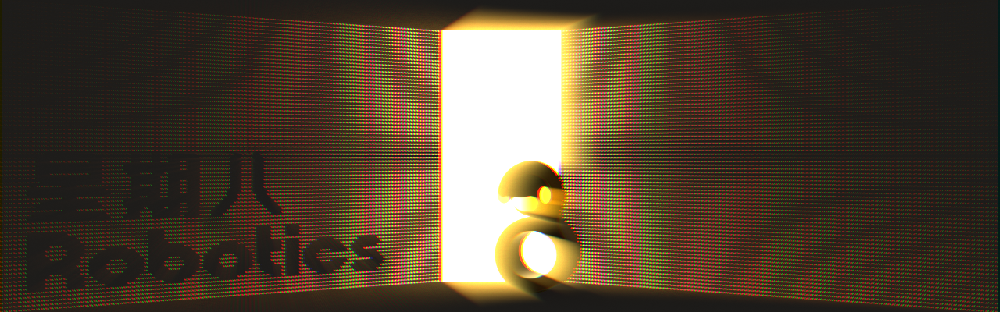
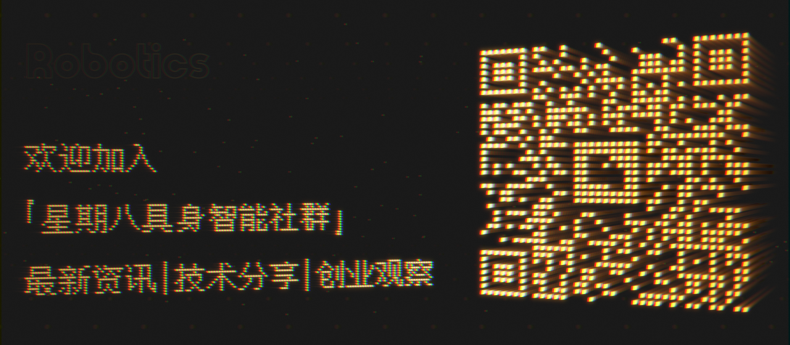

<div align="center">
  <h1>Embodied AI Knowledge Index & Industry Map</h1>
</div>

<div align="center">
  
</div>


<div align="center">
  <p>We are dedicated to bridging academic research and industrial deployment,<br />curating high-quality knowledge, tools, and career opportunities<br />to help developers and researchers access information efficiently.</p>
</div>


<p align="center">
  
  
  
  
</p>

<p align="center">
  
  
  

</p>


🌐 [Chinese Version](/README.md)

## 🎯 Our Vision

We aim to build an open gateway to embodied AI knowledge. Whether you work in a research lab or on the factory floor, your curiosity and hands-on experience both have a place here.


### 🌌 Why 'Octoday'?

Beyond the conventional seven-day cycle, **"Octoday" stands for an extra day beyond the ordinary.**

- **An Extra Perspective**: Beyond rigorous academic research, we offer pragmatic observations from industrial deployment.
- **A Deeper Understanding**: Beyond algorithmic reasoning, we cultivate reverence for the laws of the physical world.
- **An Alternative Path**: Beyond the anxiety of red-ocean competition, we open a pure and efficient channel for growth.

We hope this can become your clearest and most reliable point of reference as you explore the world of embodied AI.

Beyond the Seventh Day, explore Infinite Embodiment.

## 🗺️ Domain Map

We will gradually expand coverage across the following areas:

`🧭 Cognitive Foundation`: Help beginners build a cognitive framework for embodied AI from scratch.

`💻 Frontier Signals`: Continuously track the latest papers to form a reusable research map.

`🛠️ Tool Matrix`: Development frameworks and toolchains to support practice from experiments to deployment.

`📖 Course Resources`: Curated courses and learning resources to build systematic knowledge paths.

`🧩 Career Pathways`: Skill maps and interview guides to empower professional growth.

`🌐 Capital Dynamics`: Track investment and financing trends to gain insights into industrial structure and resource flows.

`📡 Industry Insights`: Monitor policies, trends, events, and inflection points in the industry.

## 📍 Getting Started: Your First Step

**Embodied AI** refers to intelligent systems that perceive, understand, decide, and act through a physical body interacting with the environment in real time. It brings together computer vision, reinforcement learning, and multimodal foundation models.

### 🪜 (1) Foundation Building: Construct Your Knowledge Framework

> Currently featuring `14` recommended books and `16` online courses.

Start with [Cognitive Foundation](00-basics_EN.md):

A hand-picked selection of books and courses covering the fundamentals of robotics, reinforcement learning, and computer vision. It includes open courses from leading institutions such as Stanford, CMU, and Tsinghua to help you quickly build a solid mental model and identify the core concepts and learning paths.

- [Recommended Books](00-basics_EN.md#recommended-books)
- [Online Courses](00-basics_EN.md#online-courses)

### 🔭 (2) Watchtower: Track Frontier Technologies

> Currently featuring `21` curated competitions.
> Currently featuring `10` curated conferences.
> Currently featuring `319` curated papers.

Check out the [Competition Calendar](05-competition_EN.md):

A comprehensive collection of 21 robotics competitions — from international world cups and youth education challenges to undergraduate engineering contests, with a 2026 event timeline and detailed descriptions.

Check out the [Academic Conferences](07-conferences_EN.md):

An overview of 10 core academic conferences in embodied AI and robotics, including ICRA, IROS, CoRL, NeurIPS, and more — with dates, locations, and topic analysis.

Explore the [Paper Collection](03-papers_EN.md):

Browse curated papers on embodied intelligence, deepen your understanding with open-source code, and quickly grasp the latest technological trends.

&emsp;&emsp;**Coverage**

- [Embodied Foundation Models](03-papers_EN.md#embodied-foundation-models)
- [Manipulation & Teleoperation](03-papers_EN.md#manipulation)
- [Locomotion](03-papers_EN.md#locomotion)
- [Navigation & Spatial Intelligence](03-papers_EN.md#navigation-spatial-intelligence)
- [Simulators & Sim2Real](03-papers_EN.md#simulation-sim2real)
- [Datasets](03-papers_EN.md#datasets)
- [Benchmarks & Evaluation](03-papers_EN.md#benchmarks-evaluation)
- [Survey](03-papers_EN.md#survey)

### 🔧 (3) Forge: Integrate Engineering Practice

> Currently featuring `96` tools and platforms, `87` open-source repos and communities.

Check out [Engineering Tools](04-tools_EN.md):

A collection of robot simulation platforms, motion control, various SDKs, and major open-source projects.

Check out [Open-Source Repos](06-repos_EN.md):

A curated collection of core embodied AI open-source projects, developer communities, and product platforms.

### 🔗 (4) Coordinates: Gain Industrial Insights

> Currently featuring `274` embodied AI-related companies: `171` domestic, `103` overseas.

View the [Company List](01-companies_EN.md):

A curated map of the global embodied AI enterprise landscape to help you discover potential business anchors.

### 🎒 (5) Evolution: Talent Compass

> The English jobs page currently features `85` global opportunities.

Check [Global Opportunities](02-jobs_EN.md):

The English jobs page currently focuses on overseas opportunities. The Chinese master list remains the most complete source for domestic, global, internship, campus, and special-program openings.

If you want to jump directly to a specific company's openings from the homepage, use this quick-reference table:

| Domestic Opportunities | Link | Overseas Opportunities | Link |
| :--------------------- | ------------------------------------------------------------ | :--------------------- | ------------------------------------------------------------ |
| Horizon Robotics | [Apply](02-jobs.md#jump-jobs-domestic-15) | AIM Intelligent Machines | [Apply](02-jobs_EN.md#jump-jobs-overseas-02) |
| Fourier Intelligence | [Apply](02-jobs.md#jump-jobs-domestic-04) | Amazon Robotics | [Apply](02-jobs_EN.md#jump-jobs-overseas-06) |
| Gaussian Robotics | [Apply](02-jobs.md#jump-jobs-domestic-08) | Apptronik | [Apply](02-jobs_EN.md#jump-jobs-overseas-07) |
| JAKA Robotics | [Apply](02-jobs.md#jump-jobs-domestic-02) | Aurora | [Apply](02-jobs_EN.md#jump-jobs-overseas-08) |
| Geek+ | [Apply](02-jobs.md#jump-jobs-domestic-01) | Boston Dynamics | [Apply](02-jobs_EN.md#jump-jobs-overseas-09) |
| Qianxun Intelligence | [Apply](02-jobs.md#jump-jobs-domestic-17) | Cruise | [Apply](02-jobs_EN.md#jump-jobs-overseas-10) |
| Shanghai AI Lab | [Apply](02-jobs.md#jump-jobs-domestic-20) | Figure AI | [Apply](02-jobs_EN.md#jump-jobs-overseas-13) |
| SenseTime | [Apply](02-jobs.md#jump-jobs-domestic-23) | Google DeepMind | [Apply](02-jobs_EN.md#jump-jobs-overseas-14) |
| SmartMore | [Apply](02-jobs.md#jump-jobs-domestic-19) | Grit Ventures | [Apply](02-jobs_EN.md#jump-jobs-overseas-15) |
| Tashi Navigation | [Apply](02-jobs.md#jump-jobs-domestic-09) | HTX | [Apply](02-jobs_EN.md#jump-jobs-overseas-17) |
| XPeng | [Apply](02-jobs.md#jump-jobs-domestic-16) | Nuro | [Apply](02-jobs_EN.md#jump-jobs-overseas-19) |
| Astribot | [Apply](02-jobs.md#jump-jobs-domestic-06) | NVIDIA | [Apply](02-jobs_EN.md#jump-jobs-overseas-21) |
| Galbot | [Apply](02-jobs.md#jump-jobs-domestic-07) | OpenAI | [Apply](02-jobs_EN.md#jump-jobs-overseas-22) |
| DEEPRobotics | [Apply](02-jobs.md#jump-jobs-domestic-18) | Tactus | [Apply](02-jobs_EN.md#jump-jobs-overseas-24) |
| Unitree | [Apply](02-jobs.md#jump-jobs-domestic-03) | Tesla | [Apply](02-jobs_EN.md#jump-jobs-overseas-26) |
| Agibot | [Apply](02-jobs.md#jump-jobs-domestic-25) | Toyota Research Institute | [Apply](02-jobs_EN.md#jump-jobs-overseas-27) |
| LimX Dynamics | [Apply](02-jobs.md#jump-jobs-domestic-05) | Waymo | [Apply](02-jobs_EN.md#jump-jobs-overseas-28) |
| ByteDance | [Apply](02-jobs.md#jobs-special-25) | Wayve | [Apply](02-jobs_EN.md#jump-jobs-overseas-01) |

## 🌱 Community Building

We welcome contributions in any form, whether you are adding new company information, sharing papers, or fixing errors.

- 📖  [Contributing Guide](CONTRIBUTING_EN.md) for details on how to contribute.
- ✨  [Pull Request](https://github.com/Octoday-Hub/Embodied-AI/pulls) to submit content updates directly.
- 🐛  [Issue](https://github.com/Octoday-Hub/Embodied-AI/issues) to report errors or share suggestions.

We are grateful to every contributor and look forward to building this resource together.

## 👥 About Octoday Hub

Octoday Hub is an open community of embodied AI enthusiasts, developers, and industry observers. Through systematic curation, we hope to lower the barrier to entry for developers exploring embodied AI while accelerating knowledge sharing and industrial adoption.

If you have any ideas, resource recommendations, or business collaboration inquiries, feel free to reach out:

📧  Email: [octoday@yeah.net](mailto:octoday@yeah.net)

💬  WeChat: Midsummer_Jin

📱  WeChat Official Account: 星期八Robotics

*Scan the QR code below for the latest updates and resources.*



## 🌟 Star this Repo

If this repository is helpful to you, feel free to star it, fork it, share it with peers, or cite this list.

Your support is our greatest motivation for continuous updates.

```bibtex
@misc{octoday_robotics_2026,
  author = {Octoday Embodied-AI Community},
  title  = {Embodied AI Knowledge Index and Industry Map},
  year   = {2026},
  url    = {https://github.com/Octoday-Hub/Embodied-AI}
}
```

## 📄 License

This project is licensed under [CC BY-NC-SA 4.0](https://creativecommons.org/licenses/by-nc-sa/4.0/).
