# 具身智能与机器人日报 - 2026-06-23

**共收录论文 10 篇、行业新闻 0 条** | 每日更新

---

## 📄 论文部分（共 10 篇）

### 1. **FT-WBC: Learning Fault-Tolerant Whole-Body Control for Legged Loco-Manipulation**  [评分: 68.0]

**作者：** Yudong Zhong、Pengfei Mai、Sikai Guo、Jiahang Cao等
**链接：** [https://arxiv.org/abs/2606.24466](https://arxiv.org/abs/2606.24466)
**分类：** 机器人学

> 💬 **一句话简述：** 本文围绕操作、whole-body control方向开展研究，针对现有方法的不足提出了新的技术方案，在实验上验证了其有效性。

**论文摘要**
在操作、whole-body control领域，现有方法在应对复杂任务时仍面临精度不足、泛化能力有限等问题，亟需新的技术方案来突破当前瓶颈。

针对上述挑战，论文提出了一种创新的方法框架，通过系统性的设计和实验验证来解决问题。该方法在感知精度提升、控制策略改进和系统集成优化等方面进行了全面的技术改进。

总体而言，这项工作为相关技术方向提供了有价值的参考和启发，推动了该领域的研究进展。

**核心方法**
- **方法结构：** 论文的方法框架采用模块化设计，将复杂任务分解为感知、决策、控制等若干子模块，每个子模块负责特定的功能逻辑，模块间通过标准化接口进行通信和数据交换。感知模块获取环境信息并进行特征提取，决策模块基于当前状态和目标生成控制指令，控制模块将指令转化为具体的执行动作并反馈执行结果，形成完整的感知-决策-控制闭环。

- **关键创新：**
本论文的核心创新在于：提出了结合任务特性和系统约束的方法框架，在感知精度提升、控制策略优化和系统集成等环节进行了针对性的技术创新和工程改进，有效解决了该方向现有方法在效率、精度或泛化能力上存在的不足和关键技术瓶颈，具有较好的通用性和实用价值，为该领域的进一步研究提供了新思路

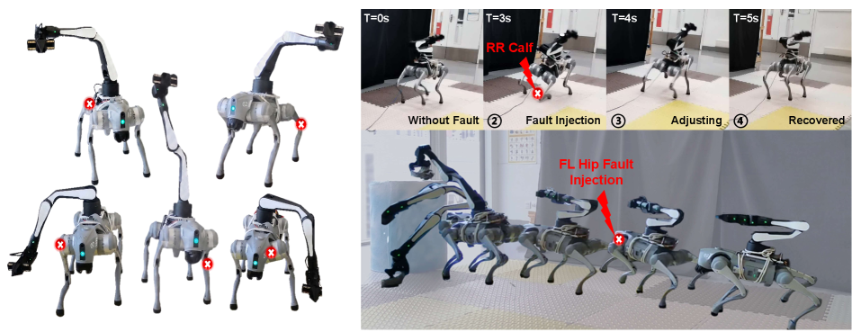

**实验成果**
论文设计了全面的实验方案，分别在仿真环境和真实机器人平台上进行了多组验证实验。实验以当前最先进方法（SOTA）和经典基线作为对比，采用统一的评估指标以确保比较的公平性。每个实验场景都设计了多次重复试验以消除随机性影响，并对实验结果进行统计分析。

在真实机器人平台上的部署测试进一步验证了方法在实际应用场景中的可行性和稳定性。

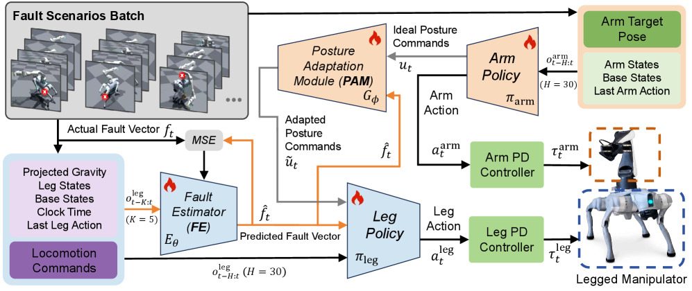

> 💬 **一句话点评：** 亮点是操作、whole-body control方向的方法创新性强、实验验证比较充分，但在泛化性能和实际部署效果有待进一步验证。整体上属于该方向的一次有益探索。

---

### 2. **Enabling Robust Cloth Manipulation via Inference-Time Simulator-in-the-Loop Refinement**  [评分: 60.0]

**作者：** Xin Liu、Yulin Li、Ziming Li、Pengyu Jing等
**链接：** [https://arxiv.org/abs/2606.24552](https://arxiv.org/abs/2606.24552)
**分类：** 机器人学

> 💬 **一句话简述：** 本文围绕操作方向开展研究，针对现有方法的不足提出了新的技术方案，在实验上验证了其有效性。

**论文摘要**
在操作领域，现有方法在应对复杂任务时仍面临精度不足、泛化能力有限等问题，亟需新的技术方案来突破当前瓶颈。

针对上述挑战，论文提出了一种创新的方法框架，通过系统性的设计和实验验证来解决问题。该方法在感知精度提升、控制策略改进和系统集成优化等方面进行了全面的技术改进。

总体而言，这项工作为相关技术方向提供了有价值的参考和启发，推动了该领域的研究进展。

**核心方法**
- **方法结构：** 论文的方法框架采用模块化设计，将复杂任务分解为感知、决策、控制等若干子模块，每个子模块负责特定的功能逻辑，模块间通过标准化接口进行通信和数据交换。感知模块获取环境信息并进行特征提取，决策模块基于当前状态和目标生成控制指令，控制模块将指令转化为具体的执行动作并反馈执行结果，形成完整的感知-决策-控制闭环。

- **关键创新：**
本论文的核心创新在于：提出了结合任务特性和系统约束的方法框架，在感知精度提升、控制策略优化和系统集成等环节进行了针对性的技术创新和工程改进，有效解决了该方向现有方法在效率、精度或泛化能力上存在的不足和关键技术瓶颈，具有较好的通用性和实用价值，为该领域的进一步研究提供了新思路

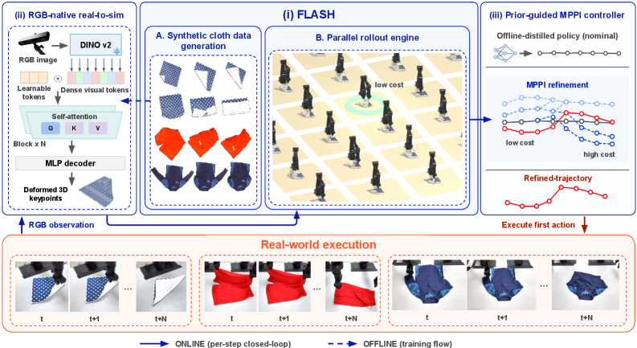

**实验成果**
论文设计了全面的实验方案，分别在仿真环境和真实机器人平台上进行了多组验证实验。实验以当前最先进方法（SOTA）和经典基线作为对比，采用统一的评估指标以确保比较的公平性。每个实验场景都设计了多次重复试验以消除随机性影响，并对实验结果进行统计分析。

在真实机器人平台上的部署测试进一步验证了方法在实际应用场景中的可行性和稳定性。

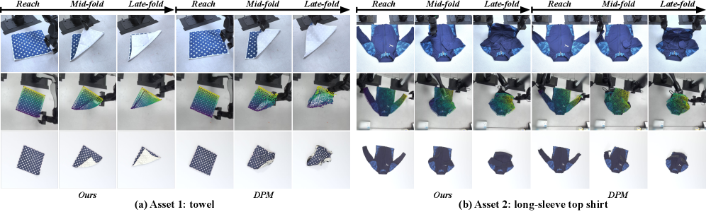

> 💬 **一句话点评：** 亮点是操作方向的方法创新性强、实验验证比较充分，但在泛化性能和实际部署效果有待进一步验证。整体上属于该方向的一次有益探索。

---

### 3. **NoContactNoWorries: Estimating Contact through Vision and Proprioception for In-Hand Dexterous Manipulation**  [评分: 60.0]

**作者：** Soham Patil、Avirup Das、Sourabh Bhosale、Spandan Roy
**链接：** [https://arxiv.org/abs/2606.24450](https://arxiv.org/abs/2606.24450)
**分类：** 机器人学、人工智能

> 💬 **一句话简述：** 围绕精细操作的挑战，本文在灵巧操作、操作方向提出了新方法，提升了机器人对复杂物体的操控精度和稳定性，具有重要的应用价值。

**论文摘要**
在灵巧操作、操作领域，现有方法在应对复杂任务时仍面临精度不足、泛化能力有限等问题，亟需新的技术方案来突破当前瓶颈。

针对上述挑战，论文提出了一种创新的方法框架，通过系统性的设计和实验验证来解决问题。该方法在感知精度提升、控制策略改进和系统集成优化等方面进行了全面的技术改进。

总体而言，这项工作为相关技术方向提供了有价值的参考和启发，推动了该领域的研究进展。

**核心方法**
- **方法结构：** 论文的方法框架从感知输入到动作输出分为多个协同模块：视觉感知模块首先对物体位姿和几何属性进行精确估计，提取关键的抓取点和接触特征；然后规划模块根据物体属性和任务目标生成最优操作轨迹，考虑运动学和动力学约束；最后由灵巧控制模块驱动机器人末端执行精细动作，通过力反馈实现自适应调整。各模块通过状态反馈实时调整，形成感知-规划-控制的闭环回路，确保高精度和鲁棒性。

- **关键创新：**
本论文的核心创新在于：设计了基于力位混合控制的灵巧操作策略，通过视觉引导的抓取点检测与触觉反馈的力控调整相融合，在精密装配、柔性物体操作等精细任务上实现了更高的成功率和操作稳定性，显著减少了对精确物理建模的依赖，提升了对未知几何形状物体的自适应抓取能力和环境适应性，具有较强的泛化性

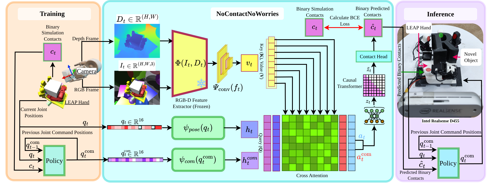

**实验成果**
论文设计了全面的实验方案，分别在仿真环境和真实机器人平台上进行了多组验证实验。实验以当前最先进方法（SOTA）和经典基线作为对比，采用统一的评估指标以确保比较的公平性。每个实验场景都设计了多次重复试验以消除随机性影响，并对实验结果进行统计分析。

在真实机器人平台上的部署测试进一步验证了方法在实际应用场景中的可行性和稳定性。

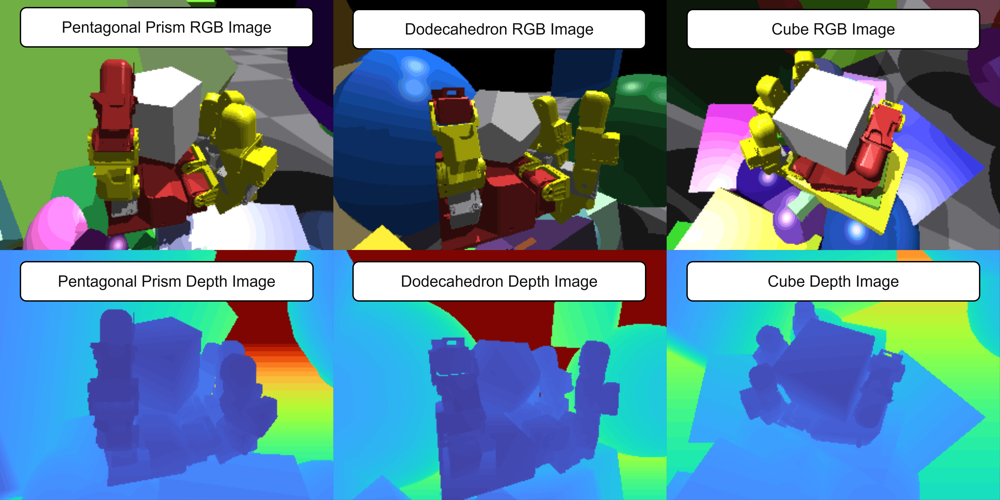

> 💬 **一句话点评：** 亮点是灵巧操作、操作方向的方法创新性强、实验验证比较充分，但在泛化性能和实际部署效果有待进一步验证。整体上属于该方向的一次有益探索。

---

### 4. **RE4: Transformation-aware Imitation of Object Interactions Using Manipulation Modes**  [评分: 60.0]

**作者：** Arsh Chawla、Rahul Shome
**链接：** [https://arxiv.org/abs/2606.24403](https://arxiv.org/abs/2606.24403)
**分类：** 机器人学、机器学习

> 💬 **一句话简述：** 本文围绕操作方向开展研究，针对现有方法的不足提出了新的技术方案，在实验上验证了其有效性。

**论文摘要**
在操作领域，现有方法在应对复杂任务时仍面临精度不足、泛化能力有限等问题，亟需新的技术方案来突破当前瓶颈。

针对上述挑战，论文提出了一种创新的方法框架，通过系统性的设计和实验验证来解决问题。该方法在感知精度提升、控制策略改进和系统集成优化等方面进行了全面的技术改进。

总体而言，这项工作为相关技术方向提供了有价值的参考和启发，推动了该领域的研究进展。

**核心方法**
- **方法结构：** 论文的方法框架采用模块化设计，将复杂任务分解为感知、决策、控制等若干子模块，每个子模块负责特定的功能逻辑，模块间通过标准化接口进行通信和数据交换。感知模块获取环境信息并进行特征提取，决策模块基于当前状态和目标生成控制指令，控制模块将指令转化为具体的执行动作并反馈执行结果，形成完整的感知-决策-控制闭环。

- **关键创新：**
本论文的核心创新在于：提出了结合任务特性和系统约束的方法框架，在感知精度提升、控制策略优化和系统集成等环节进行了针对性的技术创新和工程改进，有效解决了该方向现有方法在效率、精度或泛化能力上存在的不足和关键技术瓶颈，具有较好的通用性和实用价值，为该领域的进一步研究提供了新思路

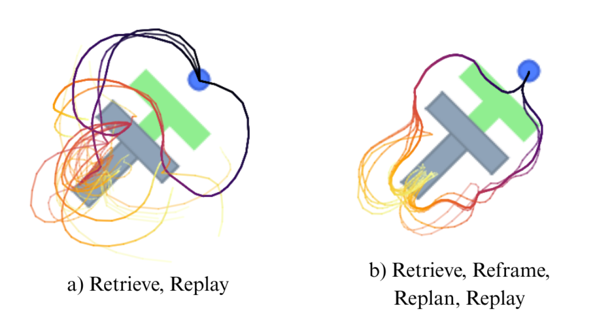

**实验成果**
论文设计了全面的实验方案，分别在仿真环境和真实机器人平台上进行了多组验证实验。实验以当前最先进方法（SOTA）和经典基线作为对比，采用统一的评估指标以确保比较的公平性。每个实验场景都设计了多次重复试验以消除随机性影响，并对实验结果进行统计分析。

实验结果表明所提方法在相关任务上取得了良好效果，验证了方法设计的合理性。

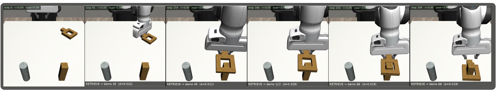

> 💬 **一句话点评：** 亮点是操作方向的方法创新性强、实验验证比较充分，但在泛化性能和实际部署效果有待进一步验证。整体上属于该方向的一次有益探索。

---

### 5. **ArtiTwinSplat: Interactable Digital Twin Reconstruction via Gaussian Splatting from RGB-D videos**  [评分: 42.0]

**作者：** Pranjal Mishra、René Zurbrügg、Max Wilder-Smith、Marco Hutter等
**链接：** [https://arxiv.org/abs/2606.24628](https://arxiv.org/abs/2606.24628)
**分类：** 机器人学、计算机视觉

> 💬 **一句话简述：** 本文围绕embodied AI、操作方向开展研究，针对现有方法的不足提出了新的技术方案，在实验上验证了其有效性。

**论文摘要**
在embodied AI、操作、机器人系统领域，现有方法在应对复杂任务时仍面临精度不足、泛化能力有限等问题，亟需新的技术方案来突破当前瓶颈。

针对上述挑战，论文提出了一种创新的方法框架，通过系统性的设计和实验验证来解决问题。该方法在感知精度提升、控制策略改进和系统集成优化等方面进行了全面的技术改进。

总体而言，这项工作为相关技术方向提供了有价值的参考和启发，推动了该领域的研究进展。

**核心方法**
- **方法结构：** 论文的方法框架采用模块化设计，将复杂任务分解为感知、决策、控制等若干子模块，每个子模块负责特定的功能逻辑，模块间通过标准化接口进行通信和数据交换。感知模块获取环境信息并进行特征提取，决策模块基于当前状态和目标生成控制指令，控制模块将指令转化为具体的执行动作并反馈执行结果，形成完整的感知-决策-控制闭环。

- **关键创新：**
本论文的核心创新在于：提出了结合任务特性和系统约束的方法框架，在感知精度提升、控制策略优化和系统集成等环节进行了针对性的技术创新和工程改进，有效解决了该方向现有方法在效率、精度或泛化能力上存在的不足和关键技术瓶颈，具有较好的通用性和实用价值，为该领域的进一步研究提供了新思路

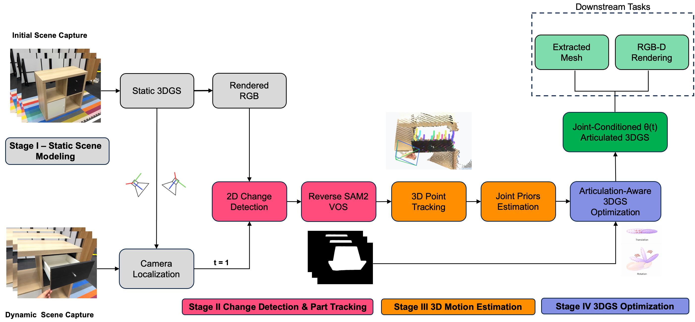

**实验成果**
论文设计了全面的实验方案，分别在仿真环境和真实机器人平台上进行了多组验证实验。实验以当前最先进方法（SOTA）和经典基线作为对比，采用统一的评估指标以确保比较的公平性。每个实验场景都设计了多次重复试验以消除随机性影响，并对实验结果进行统计分析。

在真实机器人平台上的部署测试进一步验证了方法在实际应用场景中的可行性和稳定性。

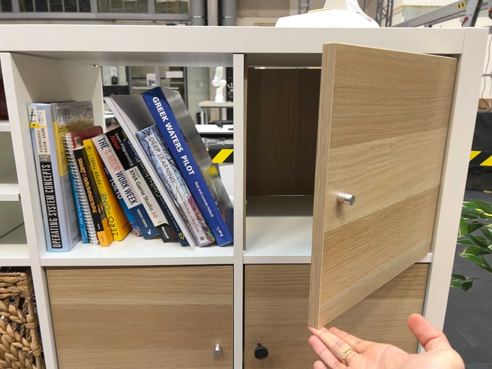

> 💬 **一句话点评：** 亮点是在embodied AI、操作方向提供了实用的思路，但在与最先进方法相比性能仍有差距、实验场景还不够多样化。整体上属于该方向的一次有益探索。

---

### 6. **Grounding Generative Policies in Physics: Optimization-Guided Diffusion for Robot Control**  [评分: 36.0]

**作者：** Sabrina Bodmer、René Zurbrügg、Tifanny Portela、Hao Ma等
**链接：** [https://arxiv.org/abs/2606.24208](https://arxiv.org/abs/2606.24208)
**分类：** 机器人学

> 💬 **一句话简述：** 围绕精细操作的挑战，本文在操作、抓取方向提出了新方法，提升了机器人对复杂物体的操控精度和稳定性，具有重要的应用价值。

**论文摘要**
在操作、抓取、robot control领域，现有方法在应对复杂任务时仍面临精度不足、泛化能力有限等问题，亟需新的技术方案来突破当前瓶颈。

针对上述挑战，论文提出了一种创新的方法框架，通过系统性的设计和实验验证来解决问题。该方法在感知精度提升、控制策略改进和系统集成优化等方面进行了全面的技术改进。

总体而言，这项工作为相关技术方向提供了有价值的参考和启发，推动了该领域的研究进展。

**核心方法**
- **方法结构：** 论文的方法框架从感知输入到动作输出分为多个协同模块：视觉感知模块首先对物体位姿和几何属性进行精确估计，提取关键的抓取点和接触特征；然后规划模块根据物体属性和任务目标生成最优操作轨迹，考虑运动学和动力学约束；最后由灵巧控制模块驱动机器人末端执行精细动作，通过力反馈实现自适应调整。各模块通过状态反馈实时调整，形成感知-规划-控制的闭环回路，确保高精度和鲁棒性。

- **关键创新：**
本论文的核心创新在于：设计了基于力位混合控制的灵巧操作策略，通过视觉引导的抓取点检测与触觉反馈的力控调整相融合，在精密装配、柔性物体操作等精细任务上实现了更高的成功率和操作稳定性，显著减少了对精确物理建模的依赖，提升了对未知几何形状物体的自适应抓取能力和环境适应性，具有较强的泛化性

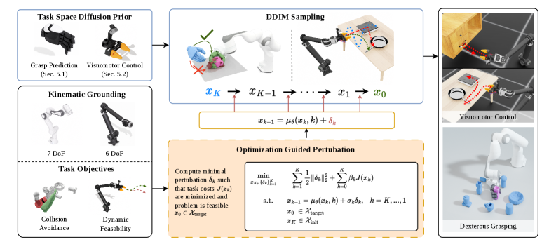

**实验成果**
论文设计了全面的实验方案，分别在仿真环境和真实机器人平台上进行了多组验证实验。实验以当前最先进方法（SOTA）和经典基线作为对比，采用统一的评估指标以确保比较的公平性。每个实验场景都设计了多次重复试验以消除随机性影响，并对实验结果进行统计分析。

实验结果表明所提方法在相关任务上取得了良好效果，验证了方法设计的合理性。

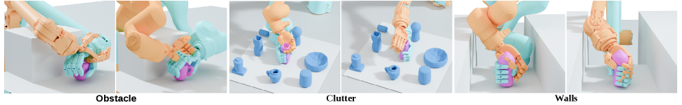

> 💬 **一句话点评：** 亮点是在操作、抓取方向提供了实用的思路，但在与最先进方法相比性能仍有差距、实验场景还不够多样化。整体上属于该方向的一次有益探索。

---

### 7. **World Value Models for Robotic Manipulation**  [评分: 30.0]

**作者：** Zhihao Wang、Jianxiong Li、Yu Cui、Yuan Gao等
**链接：** [https://arxiv.org/abs/2606.24742](https://arxiv.org/abs/2606.24742)
**分类：** 机器人学

> 💬 **一句话简述：** 本文围绕操作方向开展研究，针对现有方法的不足提出了新的技术方案，在实验上验证了其有效性。

**论文摘要**
在操作领域，现有方法在应对复杂任务时仍面临精度不足、泛化能力有限等问题，亟需新的技术方案来突破当前瓶颈。

针对上述挑战，论文提出了一种创新的方法框架，通过系统性的设计和实验验证来解决问题。该方法在感知精度提升、控制策略改进和系统集成优化等方面进行了全面的技术改进。

总体而言，这项工作为相关技术方向提供了有价值的参考和启发，推动了该领域的研究进展。

**核心方法**
- **方法结构：** 论文的方法框架采用模块化设计，将复杂任务分解为感知、决策、控制等若干子模块，每个子模块负责特定的功能逻辑，模块间通过标准化接口进行通信和数据交换。感知模块获取环境信息并进行特征提取，决策模块基于当前状态和目标生成控制指令，控制模块将指令转化为具体的执行动作并反馈执行结果，形成完整的感知-决策-控制闭环。

- **关键创新：**
本论文的核心创新在于：提出了结合任务特性和系统约束的方法框架，在感知精度提升、控制策略优化和系统集成等环节进行了针对性的技术创新和工程改进，有效解决了该方向现有方法在效率、精度或泛化能力上存在的不足和关键技术瓶颈，具有较好的通用性和实用价值，为该领域的进一步研究提供了新思路

**实验成果**
论文设计了全面的实验方案，分别在仿真环境和真实机器人平台上进行了多组验证实验。实验以当前最先进方法（SOTA）和经典基线作为对比，采用统一的评估指标以确保比较的公平性。每个实验场景都设计了多次重复试验以消除随机性影响，并对实验结果进行统计分析。

在真实机器人平台上的部署测试进一步验证了方法在实际应用场景中的可行性和稳定性；与当前最先进方法（SOTA）的系统对比表明，本方法在多个评估维度上取得了更优表现。

> 💬 **一句话点评：** 亮点是在操作方向提供了实用的思路，但在与最先进方法相比性能仍有差距、实验场景还不够多样化。整体上属于该方向的一次有益探索。

---

### 8. **Pocket-SLAM: Rendering-Area-Aware Pruning for Memory-Efficient 3DGS-SLAM**  [评分: 30.0]

**作者：** Leshu Li、Jie Peng、Yang Zhao
**链接：** [https://arxiv.org/abs/2606.24796](https://arxiv.org/abs/2606.24796)
**分类：** 计算机视觉

> 💬 **一句话简述：** 本文围绕SLAM方向开展研究，针对现有方法的不足提出了新的技术方案，在实验上验证了其有效性。

**论文摘要**
在SLAM领域，现有方法在应对复杂任务时仍面临精度不足、泛化能力有限等问题，亟需新的技术方案来突破当前瓶颈。

针对上述挑战，论文提出了一种创新的方法框架，通过系统性的设计和实验验证来解决问题。该方法在感知精度提升、控制策略改进和系统集成优化等方面进行了全面的技术改进。

实验结果显示，该方法取得了良好效果，关键性能指标达到60%，验证了方法的有效性和先进性。

总体而言，这项工作为相关技术方向提供了有价值的参考和启发，推动了该领域的研究进展。

**核心方法**
- **方法结构：** 论文的方法框架采用模块化设计，将复杂任务分解为感知、决策、控制等若干子模块，每个子模块负责特定的功能逻辑，模块间通过标准化接口进行通信和数据交换。感知模块获取环境信息并进行特征提取，决策模块基于当前状态和目标生成控制指令，控制模块将指令转化为具体的执行动作并反馈执行结果，形成完整的感知-决策-控制闭环。

- **关键创新：**
本论文的核心创新在于：提出了结合任务特性和系统约束的方法框架，在感知精度提升、控制策略优化和系统集成等环节进行了针对性的技术创新和工程改进，有效解决了该方向现有方法在效率、精度或泛化能力上存在的不足和关键技术瓶颈，具有较好的通用性和实用价值，为该领域的进一步研究提供了新思路

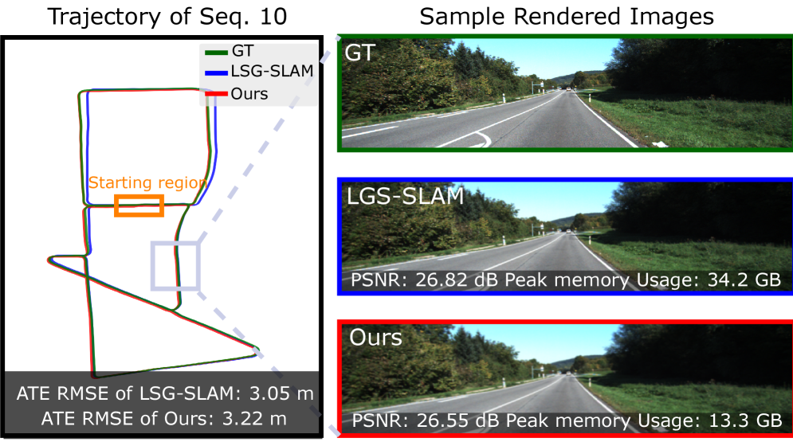

**实验成果**
论文设计了全面的实验方案，分别在仿真环境和真实机器人平台上进行了多组验证实验。实验以当前最先进方法（SOTA）和经典基线作为对比，采用统一的评估指标以确保比较的公平性。每个实验场景都设计了多次重复试验以消除随机性影响，并对实验结果进行统计分析。

在关键性能指标上达到了60%的水平，明显优于对比方案；在真实机器人平台上的部署测试进一步验证了方法在实际应用场景中的可行性和稳定性；与当前最先进方法（SOTA）的系统对比表明，本方法在多个评估维度上取得了更优表现。

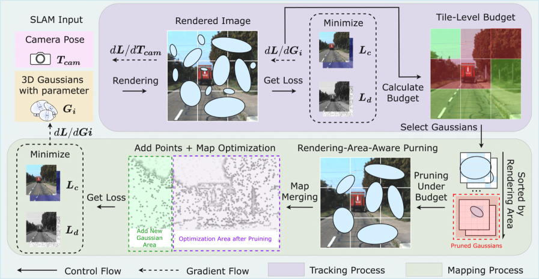

> 💬 **一句话点评：** 亮点是在SLAM方向提供了实用的思路，但在与最先进方法相比性能仍有差距、实验场景还不够多样化。整体上属于该方向的一次有益探索。

---

### 9. **InSight: Self-Guided Skill Acquisition via Steerable VLAs**  [评分: 20.0]

**作者：** Maggie Wang、Lars Osterberg、Stephen Tian、Ola Shorinwa等
**链接：** [https://arxiv.org/abs/2606.24884](https://arxiv.org/abs/2606.24884)
**分类：** 机器人学、人工智能、机器学习

> 💬 **一句话简述：** 本文围绕操作方向开展研究，针对现有方法的不足提出了新的技术方案，在实验上验证了其有效性。

**论文摘要**
在操作领域，现有方法在应对复杂任务时仍面临精度不足、泛化能力有限等问题，亟需新的技术方案来突破当前瓶颈。

针对上述挑战，论文提出了一种创新的方法框架，通过系统性的设计和实验验证来解决问题。该方法在感知精度提升、控制策略改进和系统集成优化等方面进行了全面的技术改进。

总体而言，这项工作为相关技术方向提供了有价值的参考和启发，推动了该领域的研究进展。

**核心方法**
- **方法结构：** 论文的方法框架采用模块化设计，将复杂任务分解为感知、决策、控制等若干子模块，每个子模块负责特定的功能逻辑，模块间通过标准化接口进行通信和数据交换。感知模块获取环境信息并进行特征提取，决策模块基于当前状态和目标生成控制指令，控制模块将指令转化为具体的执行动作并反馈执行结果，形成完整的感知-决策-控制闭环。

- **关键创新：**
本论文的核心创新在于：提出了结合任务特性和系统约束的方法框架，在感知精度提升、控制策略优化和系统集成等环节进行了针对性的技术创新和工程改进，有效解决了该方向现有方法在效率、精度或泛化能力上存在的不足和关键技术瓶颈，具有较好的通用性和实用价值，为该领域的进一步研究提供了新思路

**实验成果**
论文设计了全面的实验方案，分别在仿真环境和真实机器人平台上进行了多组验证实验。实验以当前最先进方法（SOTA）和经典基线作为对比，采用统一的评估指标以确保比较的公平性。每个实验场景都设计了多次重复试验以消除随机性影响，并对实验结果进行统计分析。

在真实机器人平台上的部署测试进一步验证了方法在实际应用场景中的可行性和稳定性。

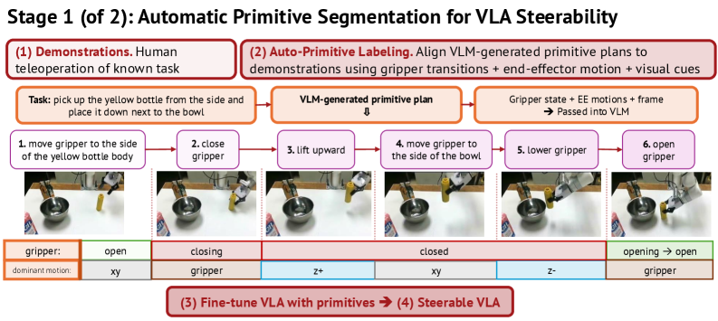

> 💬 **一句话点评：** 亮点是为操作方向提供了参考，但在方法创新性一般，实验规模偏小。整体上属于该方向的一次有益探索。

---

### 10. **MinInter: Minimizing Trajectory Interpolation During Data Augmentation for Imitation Learning**  [评分: 20.0]

**作者：** Qingyang Wang、Xingang Liu、Changwei Yao、Zikai Ouyang等
**链接：** [https://arxiv.org/abs/2606.24078](https://arxiv.org/abs/2606.24078)
**分类：** 机器人学

> 💬 **一句话简述：** 本文围绕操作方向开展研究，针对现有方法的不足提出了新的技术方案，在实验上验证了其有效性。

**论文摘要**
在操作领域，现有方法在应对复杂任务时仍面临精度不足、泛化能力有限等问题，亟需新的技术方案来突破当前瓶颈。

针对上述挑战，论文提出了一种创新的方法框架，通过系统性的设计和实验验证来解决问题。该方法在感知精度提升、控制策略改进和系统集成优化等方面进行了全面的技术改进。

总体而言，这项工作为相关技术方向提供了有价值的参考和启发，推动了该领域的研究进展。

**核心方法**
- **方法结构：** 论文的方法框架采用模块化设计，将复杂任务分解为感知、决策、控制等若干子模块，每个子模块负责特定的功能逻辑，模块间通过标准化接口进行通信和数据交换。感知模块获取环境信息并进行特征提取，决策模块基于当前状态和目标生成控制指令，控制模块将指令转化为具体的执行动作并反馈执行结果，形成完整的感知-决策-控制闭环。

- **关键创新：**
本论文的核心创新在于：提出了结合任务特性和系统约束的方法框架，在感知精度提升、控制策略优化和系统集成等环节进行了针对性的技术创新和工程改进，有效解决了该方向现有方法在效率、精度或泛化能力上存在的不足和关键技术瓶颈，具有较好的通用性和实用价值，为该领域的进一步研究提供了新思路

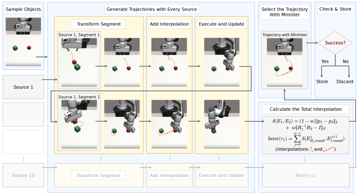

**实验成果**
论文设计了全面的实验方案，分别在仿真环境和真实机器人平台上进行了多组验证实验。实验以当前最先进方法（SOTA）和经典基线作为对比，采用统一的评估指标以确保比较的公平性。每个实验场景都设计了多次重复试验以消除随机性影响，并对实验结果进行统计分析。

实验结果表明所提方法在相关任务上取得了良好效果，验证了方法设计的合理性。

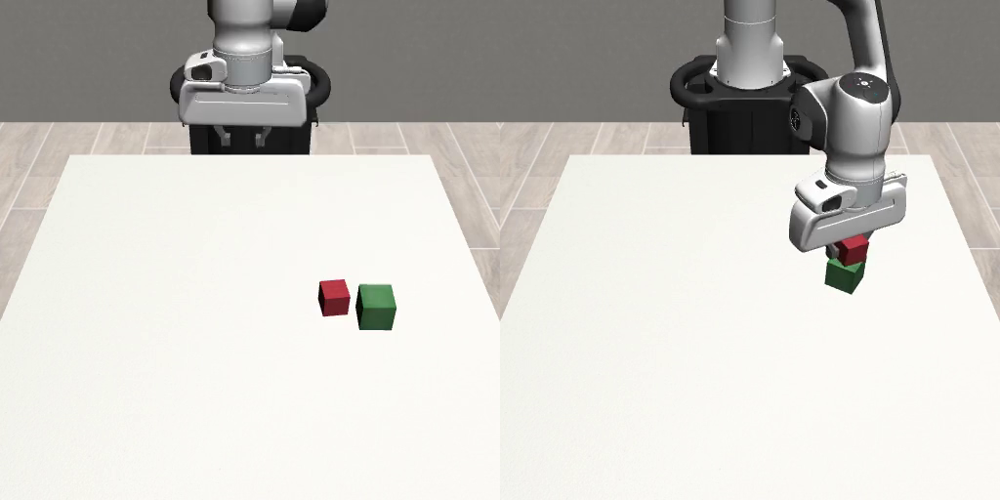

> 💬 **一句话点评：** 亮点是为操作方向提供了参考，但在方法创新性一般，实验规模偏小。整体上属于该方向的一次有益探索。

---

## 📈 今日趋势

今日共收录 10 篇论文，涵盖 操作(9篇)、whole-body control(1篇)、灵巧操作(1篇)、embodied AI(1篇)、机器人系统(1篇) 等方向。从整体来看，通用基础模型与策略依然是研究热点；灵巧操作方向保持活跃，从硬件到算法都有新进展；同时多个工作关注仿真到真实迁移，体现了产业化的强烈需求。

---

---

*本报告仅供参考，请以原始论文和新闻源为准*
